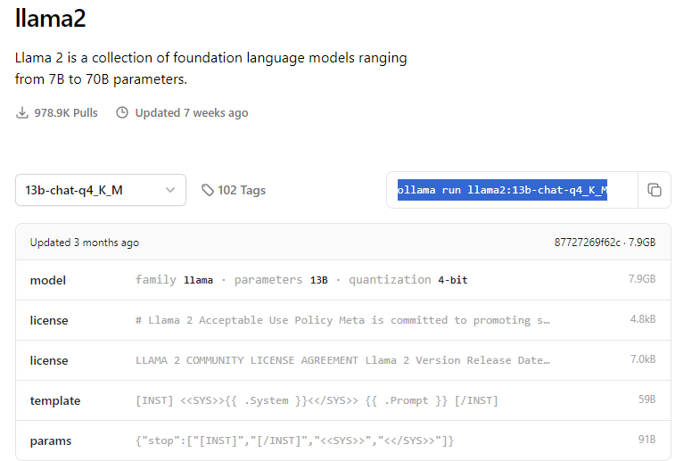

# Local LLM Guide with Ollama server

## 0. Install Ollama

run the following command in a conda env with CUDA etc.

Linux:

``` shell
curl -fsSL https://ollama.com/install.sh | sh
```

Windows or macOS:

- Download from [here](https://ollama.com/download/)

## 1. Install Models

Ollama model names can be found [here](https://ollama.com/library) (See example below)



Once you have found the model you want to use copy the command and run it in your conda env.

Example of llama2 q4 quantized:

``` shell
conda activate <env_name>
ollama run llama2:13b-chat-q4_K_M
```

you can check which models you have downloaded like this:

``` shell
~$ ollama list
NAME                            ID              SIZE    MODIFIED
llama2:latest                   78e26419b446    3.8 GB  6 weeks ago
mistral:7b-instruct-v0.2-q4_K_M eb14864c7427    4.4 GB  2 weeks ago
starcoder2:latest               f67ae0f64584    1.7 GB  19 hours ago
```

## 2. Run Ollama in CLI

This command starts up the ollama server that is on port `11434`

This will show the requests in CLI

``` shell
conda activate <env_name>
ollama serve
```

or

This will run with no output in the background

``` shell
sudo systemctl start ollama
```

If you see something like this:

``` log
Error: listen tcp 127.0.0.1:11434: bind: address already in use
```

This is not an error it just means the server is already running

To stop the server use:

``` shell
sudo systemctl stop ollama
```

For more info go [here](https://github.com/ollama/ollama/blob/main/docs/faq.md)

## 3. Follow the default installation of OpenDevin

``` shell
git clone git@github.com:OpenDevin/OpenDevin.git
```

or

``` shell
git clone git@github.com:<YOUR-USERNAME>/OpenDevin.git
```

then

``` shell
cd OpenDevin
```

## 4. Run setup commands

``` shell
make build
make setup-config
```

## 5. Modify config file

- After running `make setup-config` you will see a generated file `OpenDevin/config.toml`.
- Open this file and modify it to your needs based on this template:

``` conf
LLM_API_KEY=""
LLM_MODEL="<model_name>"
LLM_BASE_URL="<host>:<port_number>"
LLM_EMBEDDING_STRATEGY="<strategy>"
LLM_EMBEDDING_MODEL="<embedding_model_name>"
LLM_EMBEDDING_BASE_URL="<host>:<port_number>"
WORKSPACE_DIR="./workspace"
```

Example using ollama:

``` conf
LLM_API_KEY=""
LLM_MODEL="ollama/llama3:latest"
LLM_BASE_URL="http://localhost:11434"
LLM_EMBEDDING_STRATEGY="ollama"
LLM_EMBEDDING_MODEL="ollama/llama2:latest"
LLM_EMBEDDING_BASE_URL="http://localhost:11434"
WORKSPACE_DIR="./workspace"
```

Notes:

- The embedding strategy ollama was used in this example.
  - The base urls:
    - By default ollama host is `localhost` unless you set it
    - By default ollama port is `11434` unless you set it
  - `model_name` needs to be the entire model name
    - Example: `LLM_MODEL="ollama/llama2:latest"`
    - List names: `ollama list` to get the list of available models.
      - Prefix ollama/ to the model name to get the full model name.

General Public API LLM options for embeddings (OpenAI, Mistral) only require Model and API_KEY. The BASE_URL is a shared API endpoint provided, the library is self aware.

Azure OpenAI requires more fields as each instance is unique and have its own identifier:

``` conf
LLM_EMBEDDING_MODEL="text-embedding-ada-002"                 # is your azure openai llm model
LLM_EMBEDDING_BASE_URL="https://mycompany.openai.azure.com/" # is your azure_enpoint for your instance "https://<your-resource-name>.openai.azure.com/"
LLM_DEPLOYMENT_NAME="my-chatgpt"                             # is your azure_deployment for your instance "my-custom-embedding"
LLM_API_VERSION="2024-02-15-preview"                         # is your azure api_version for your instance "2023-07-01-preview"
LLM_API_KEY="api-***"                                        # is your azure api_key to access your instance
```

## 6. Start OpenDevin

At this point everything should be set up and working properly.

1. Start by running the ollama server using the method outlined above
2. Run `make build` in your terminal `~/OpenDevin/`
3. Run `make run` in your terminal
4. If that fails try running the server and front end in sepparate terminals:
   . In the first terminal `make start-backend`
   . In the second terminal `make start-frontend`
5. you should now be able to connect to `http://localhost:3001/` with your local model running!
